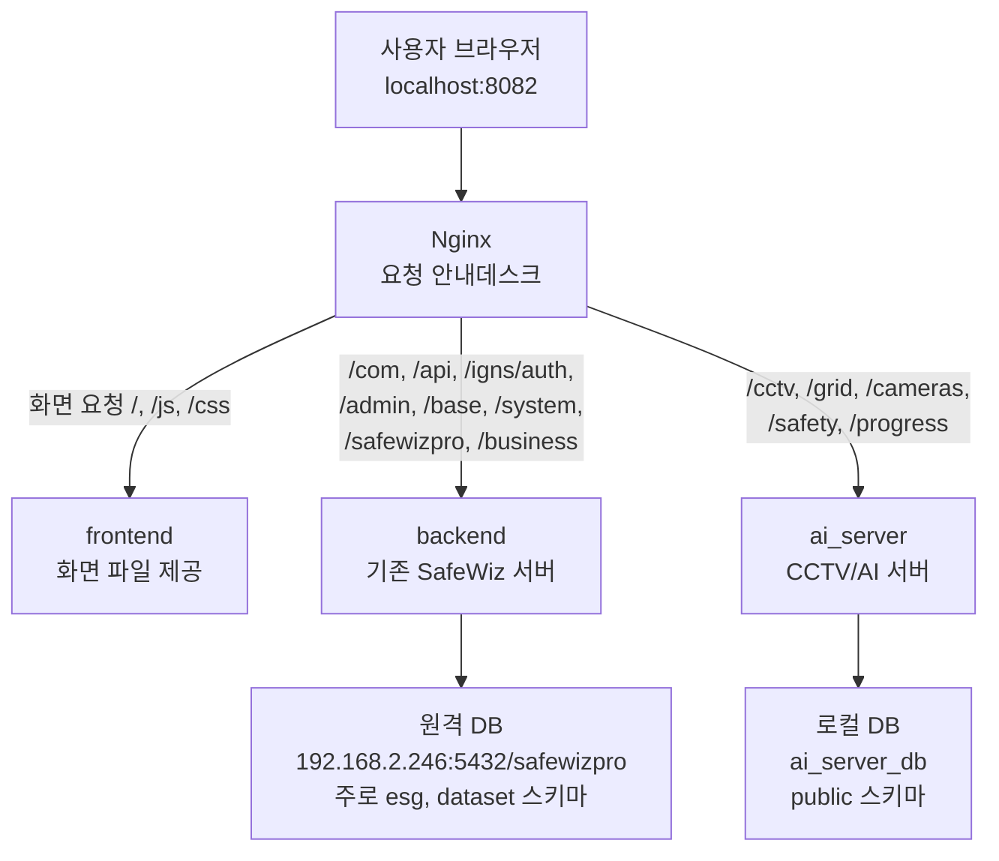
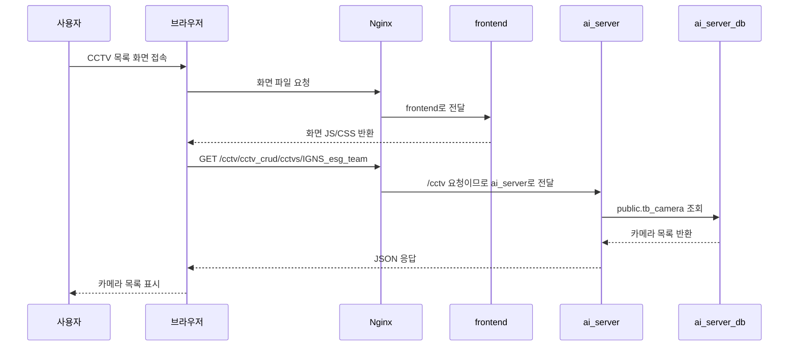

# Backend, AI Server, DB 흐름 학습 노트

작성일: 2026-06-18  
위치: `C:\iljoowork\seongdong\cctv_app2\cctv_app`

## 1. 한 줄 요약

SafeWiz 화면은 하나처럼 보이지만, 뒤에서는 요청 주소에 따라 서로 다른 서버와 DB로 나뉘어 동작한다.

```text
기존 SafeWiz 기능 = backend -> 원격 safewizpro DB
CCTV/AI 기능     = ai_server -> 로컬 ai_server_db DB
```

## 2. 쉬운 비유

전체 시스템을 하나의 회사 건물이라고 생각하면 이해하기 쉽다.

```text
사용자 브라우저 = 손님
Nginx           = 1층 안내데스크
frontend        = 화면을 보여주는 전시실
backend         = 기존 SafeWiz 업무 부서
ai_server       = CCTV/AI 관제실
원격 safewizpro DB = 본사 문서창고
로컬 ai_server_db  = CCTV 관제실 전용 캐비닛
```

손님이 건물에 들어오면 안내데스크인 Nginx가 요청을 보고 담당 부서로 보낸다.

```text
화면 파일이 필요하면 frontend로 보낸다.
로그인, 메뉴, 기존 SafeWiz 업무면 backend로 보낸다.
CCTV, AI, 카메라 관리면 ai_server로 보낸다.
```

## 3. 전체 흐름도



## 4. docker-compose.yml에서 보는 역할

파일:

```text
C:\iljoowork\seongdong\cctv_app2\cctv_app\docker-compose.yml
```

### backend

`backend`는 기존 SafeWiz 서버다. DB 접속 정보는 `command`에 Spring Boot 실행 옵션으로 들어간다.

```yaml
backend:
  command:
    - --spring.datasource.hikari.first.jdbc-url=jdbc:log4jdbc:postgresql://192.168.2.246:5432/safewizpro
    - --spring.datasource.hikari.first.username=safewizpro
    - --spring.datasource.hikari.first.password=esg2024
```

뜻:

```text
backend는 compose 안의 로컬 DB를 보지 않는다.
이미 외부에 있는 192.168.2.246:5432/safewizpro DB를 본다.
```

### ai_server_db

`ai_server_db`는 로컬에서 직접 띄우는 PostgreSQL DB 컨테이너다.

```yaml
ai_server_db:
  container_name: ai_server_db
  image: timescale/timescaledb:latest-pg15
  environment:
    POSTGRES_USER: ai_server_db
    POSTGRES_PASSWORD: "!Gns@seongdong"
    POSTGRES_DB: ai_server_db
```

뜻:

```text
Docker 안에 ai_server_db라는 DB 서버를 만든다.
DB 이름도 ai_server_db다.
접속 계정도 ai_server_db다.
```

### ai_server

`ai_server`는 CCTV/AI 기능을 담당하는 FastAPI 서버다.

```yaml
ai_server:
  environment:
    DB_HOST: ai_server_db
    DB_NAME: ai_server_db
    DB_USER: ai_server_db
    DB_PASSWORD: "!Gns@seongdong"
```

뜻:

```text
ai_server는 ai_server_db 컨테이너 안의 ai_server_db 데이터베이스에 접속한다.
```

## 5. 왜 ai_server_db를 따로 적어야 할까?

`ai_server`에 적은 DB 정보는 주소표다.  
`ai_server_db`는 실제 DB 창고다.

```text
ai_server = CCTV 관제실 직원
DB_HOST, DB_NAME, DB_USER, DB_PASSWORD = 직원 책상 위의 창고 주소 메모
ai_server_db = 실제 창고 건물
```

직원에게 주소 메모만 있어도, 실제 창고가 없으면 갈 곳이 없다.  
그래서 둘 다 필요하다.

```text
ai_server_db 서비스
= DB 서버 자체를 실행하는 설정

ai_server.environment.DB_...
= ai_server가 그 DB 서버에 접속하는 설정
```

## 6. Nginx가 요청을 나누는 방법

파일:

```text
C:\iljoowork\seongdong\cctv_app2\cctv_app\volume\nginx\conf.d\jeonjin-camera.i-gns.co.kr.conf
```

Nginx 설정 안에는 세 서버의 별명이 있다.

```nginx
set $ai_server_upstream ai_server:8000;
set $backend_upstream backend:80;
set $frontend_upstream frontend:80;
```

화면 파일은 frontend로 간다.

```nginx
location / {
    proxy_pass http://$frontend_upstream$request_uri;
}
```

기존 SafeWiz 업무 요청은 backend로 간다.

```nginx
location ~ ^/(com|api|igns/auth|admin|base|comp|fems|system|safewizpro|business) {
    proxy_pass http://$backend_upstream$request_uri;
}
```

CCTV/AI 요청은 ai_server로 간다.

```nginx
location /cctv {
    proxy_pass http://$ai_server_upstream$request_uri;
}

location /grid {
    proxy_pass http://$ai_server_upstream$request_uri;
}

location /safety {
    proxy_pass http://$ai_server_upstream$request_uri;
}
```

## 7. CCTV 목록 화면이 뜨는 과정

예시 화면:

```text
http://localhost:8082/#/SafetyDetectionCameraManage
```

여기서 `#/SafetyDetectionCameraManage`는 브라우저 안에서만 쓰는 프론트 라우터 주소다.  
서버 입장에서는 처음에 화면 파일을 달라는 요청으로 시작한다.



화면 입장에서는 예전과 같은 API 주소를 부른다.

```text
/cctv/cctv_crud/cctvs/IGNS_esg_team
```

하지만 뒤쪽 DB가 바뀌었다.

```text
이전 느낌:
화면 -> /cctv API -> ai_server -> 원격 safewizpro.public

현재:
화면 -> /cctv API -> ai_server -> 로컬 ai_server_db.public
```

## 8. ai_server 안에서 DB를 보는 코드 흐름

### DB 접속 주소 만들기

파일:

```text
volume\ai_server\config\config.py
```

이 파일은 `DB_HOST`, `DB_NAME`, `DB_USER`, `DB_PASSWORD`를 읽어서 SQLAlchemy 접속 URL을 만든다.

```text
DB_HOST=ai_server_db
DB_NAME=ai_server_db
DB_USER=ai_server_db
DB_PASSWORD=!Gns@seongdong
```

### DB 세션 만들기

파일:

```text
volume\ai_server\core\database\session.py
```

이 파일은 실제 DB 연결 엔진과 세션을 만든다.

```text
settings.DATABASE_URL -> create_engine -> SessionLocal -> get_db()
```

### CCTV API 라우터

파일:

```text
volume\ai_server\service\cctv\routes.py
```

여기서 `/cctv/cctv_crud` API가 정의된다.

```python
router = APIRouter(prefix="/cctv/cctv_crud", tags=["카메라 관리"])
```

카메라 목록 조회 API는 이런 흐름이다.

```text
GET /cctv/cctv_crud/cctvs/{comp_id}
-> get_db()로 DB 세션 받기
-> service.list_cameras_by_comp()
-> repository에서 tb_camera 조회
```

### CCTV 테이블 모델

파일:

```text
volume\ai_server\service\cctv\model.py
```

이 모델은 DB의 `public.tb_camera`와 연결된다.

```python
__tablename__ = "tb_camera"
__table_args__ = {"schema": "public"}
```

뜻:

```text
ai_server가 Camera 데이터를 조회할 때
ai_server_db 데이터베이스 안의 public.tb_camera 테이블을 본다.
```

## 9. 한 화면에서 두 DB가 같이 쓰이는 느낌

중요한 점:

```text
브라우저가 DB를 직접 보는 것이 아니다.
브라우저는 API 주소만 부른다.
Nginx가 API 주소를 보고 담당 서버로 나눈다.
각 서버가 자기 DB를 본다.
```

한 화면에서 이런 일이 같이 일어날 수 있다.

```text
로그인 사용자 정보 조회
-> /igns/auth 또는 /system 계열
-> backend
-> 원격 safewizpro DB

CCTV 목록 조회
-> /cctv/cctv_crud/cctvs/...
-> ai_server
-> 로컬 ai_server_db DB
```

그래서 한 화면인데도 뒤에서는 두 부서가 각각 자기 장부를 보는 것처럼 움직인다.

## 10. DBeaver 접속 정보

앞으로 로컬 AI 서버 DB를 볼 때는 아래 값으로 접속한다.

```text
Host: localhost
Port: 5434
Database: ai_server_db
Username: ai_server_db
Password: !Gns@seongdong
```

주의:

```text
postgres 데이터베이스는 PostgreSQL 기본 DB라 남아 있을 수 있다.
하지만 CCTV/AI에서 실제로 쓰는 DB는 ai_server_db다.
```

## 11. 기억용 핵심 문장

```text
Nginx는 안내데스크다.
backend와 ai_server는 서로 다른 담당 부서다.
backend는 원격 safewizpro DB를 본다.
ai_server는 로컬 ai_server_db DB를 본다.
화면은 DB를 직접 보지 않고 API 주소만 부른다.
```

## 12. 문제를 볼 때 확인 순서

화면에 데이터가 안 보이면 아래 순서로 확인한다.

1. 화면이 어떤 API를 부르는지 확인한다.
2. API 주소가 `/cctv`, `/grid`, `/safety` 계열인지 확인한다.
3. `/cctv` 계열이면 `ai_server`와 `ai_server_db`를 확인한다.
4. `/system`, `/business`, `/igns/auth` 계열이면 `backend`와 원격 `safewizpro` DB를 확인한다.
5. Nginx 설정에서 해당 경로가 어디로 proxy_pass 되는지 확인한다.

자주 쓰는 확인 명령:

```powershell
cd C:\iljoowork\seongdong\cctv_app2\cctv_app

docker ps

docker exec ai_server sh -c "env | sort | grep '^DB_'"

docker exec -e PGPASSWORD='!Gns@seongdong' ai_server_db psql `
  -U ai_server_db -d ai_server_db `
  -c "SELECT COUNT(*) FROM public.tb_camera;"
```

## 13. 최종 그림

```text
사용자
  |
  v
브라우저
  |
  v
Nginx
  |-- 화면 요청 -----------------> frontend
  |
  |-- 기존 SafeWiz 요청 ----------> backend -----> 원격 safewizpro DB
  |
  |-- CCTV/AI 요청 ---------------> ai_server ---> 로컬 ai_server_db DB
```

이 구조를 기억하면 `docker-compose.yml`을 볼 때도 덜 헷갈린다.

```text
backend 쪽 DB 정보는 command 안의 spring.datasource 설정을 본다.
ai_server 쪽 DB 정보는 environment 안의 DB_HOST, DB_NAME, DB_USER, DB_PASSWORD를 본다.
ai_server_db 서비스는 로컬 DB 서버 자체를 띄우는 설정이다.
```
